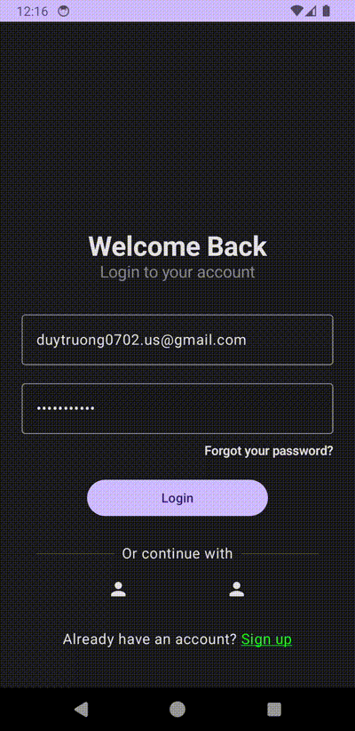
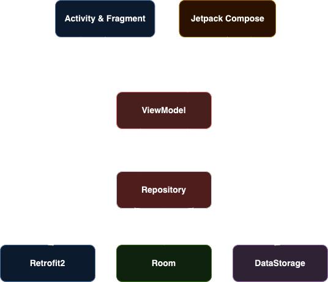
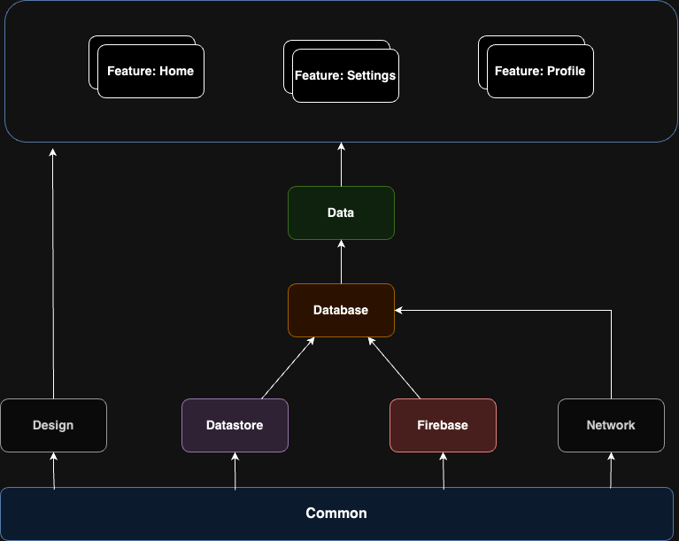

Task Manager Application
==================

This is the repository for the Task Manager Application. It is a **work in progress** 🚧.

**Task Manager Application** is a fully functional Android app built entirely with Kotlin and Jetpack Compose. It
follows Android design and development best practices and is intended to be a useful reference
for developers. As a running app, it's intended to help developers keep up-to-date with the world
of Android development by providing regular news updates.

# Demo 

# Features

**Task Manager** allows users to create and save locally and remotely by logging into user email. Using **Firestore** to sync and manage tasks

# Overview MVVM Clean Architecture

**Task Manager** is built based on MVVM Clean Architecture suggested by Google for the best practice Android Development. This target of architecture allows the app to scale, increases the app's robustness, and makes the app easier to test.
Based on these principles: 
- [Separation of concerns](https://en.wikipedia.org/wiki/Separation_of_concerns): is the most important principle in Android particularly, in software developement general.
  It leads to creating a project with less conflict or overlapping between code implementation, and business logic as possible.
  To follow the rule, developers must answer questions for **What** of code implementation. Based on that, developers can define which implementations work with which concerns.
- 
- 

## Architecture

 

 ## Module Dependencies

 
